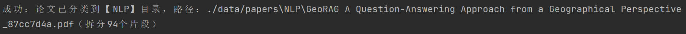
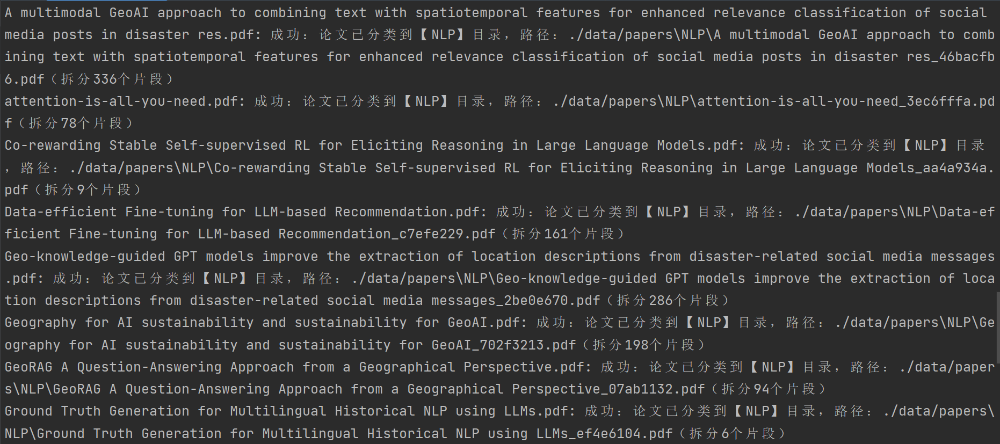
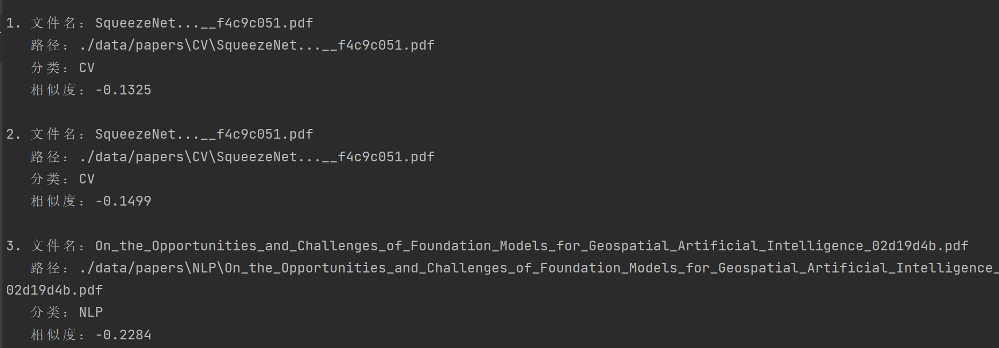
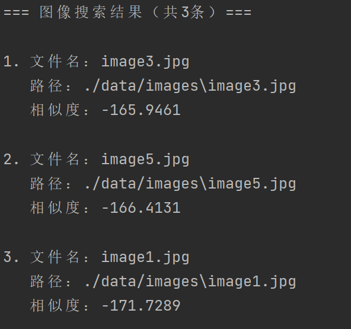
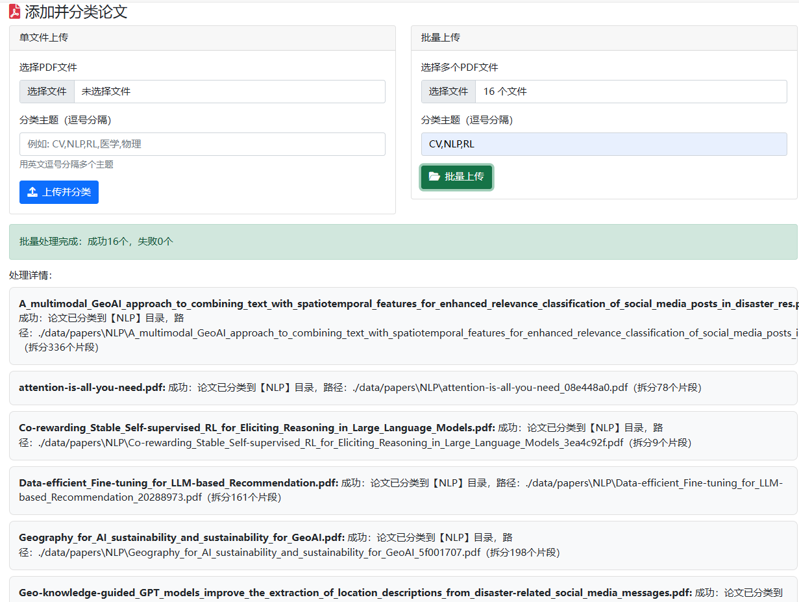
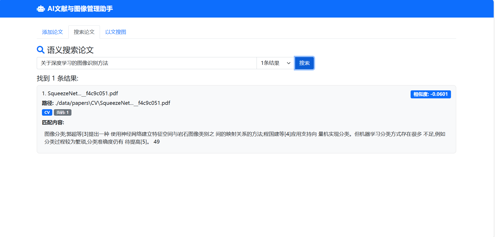
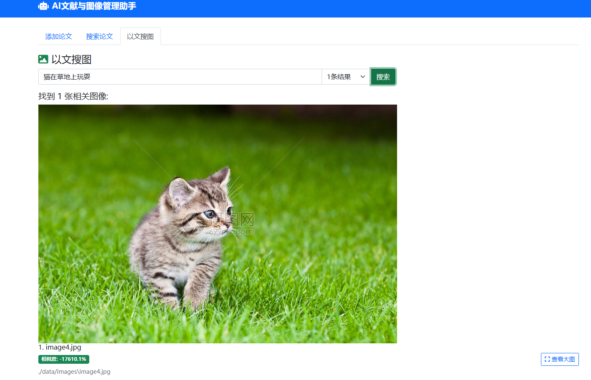

# 本地 AI 智能文献与图像管理助手
https://github.com/hetuntunNi/Multi-Modal-Agent-literature-and-image-management

## 项目简介
本项目是基于Python 3.10开发的本地多模态AI智能助手，解决本地文献（PDF）和图像的管理难题。通过语义搜索和自动分类技术，替代传统的文件名搜索，支持：
- 论文的语义搜索、单文件/批量自动分类
- 本地图像的以文搜图功能
- 完全本地化部署（无数据上传），保护隐私

### 核心功能
| 模块         | 功能列表                                                                 |
|--------------|--------------------------------------------------------------------------|
| 智能文献管理 | 1. 自然语言语义搜索论文<br>2. 单文件自动分类到指定主题<br>3. 批量整理混乱的论文文件夹 |
| 智能图像管理 | 1. 自然语言描述搜索本地图像<br>2. 自动建立图像嵌入索引                     |

### 模块介绍
1.src/document_manager.py：
- 功能：PDF文档管理和语义搜索系统 
- 主要处理PDF文件，按页码提取文本并分割成小片段 
- 自动对论文进行分类（基于主题相似度） 
- 将文档片段存入向量数据库，支持语义搜索 
- 提供批量整理PDF文件夹的功能 
- 搜索时返回匹配的文本片段、页码和相似度

2.src/image_manager.py：
- 功能：图像文件管理和以文搜图系统
- 支持多种图像格式（JPG、PNG等）
- 自动扫描图像目录并建立向量索引
- 使用CLIP模型实现"以文搜图"功能
- 返回与文本描述最匹配的图像文件

3.src/embedding.py：
- 功能：统一的嵌入模型管理（单例模式）
- 集成两种模型：
文本嵌入——使用SentenceTransformer生成文本向量；
图像嵌入——使用CLIP模型处理图像和文本。
- 支持文本到向量、图像到向量、文本CLIP嵌入的转换
- 自动检测GPU加速，提高处理效率

4.src/vector_db.py
- 功能：基于ChromaDB的向量数据库封装
- 提供简单的API进行向量存储和查询
- 支持持久化存储，数据不会丢失
- 封装了集合管理、数据添加和相似性查询功能

## 环境配置
### 系统要求
- 操作系统：Windows
- Python版本：3.10
- 内存：8GB+（推荐16GB+，用于加载模型）
- 可选：NVIDIA GPU（CUDA 11.8+，加速模型推理）

### 依赖安装
```bash
# 1. 克隆仓库
git clone https://github.com/hetuntunNi/Multi-Modal-Agent-literature-and-image-management.git
cd Multi-Modal-Agent-literature-and-image-management

# 2. 安装依赖
pip install -r requirements.txt
```

## 运行示例
```bash
# 示例：将论文分类到CV、NLP、RL主题
python main.py add_paper "docs/GeoRAG A Question-Answering Approach from a Geographical Perspective.pdf" --topics "CV,NLP,RL"
```

```bash
# 示例：整理papers文件夹下的所有PDF
python main.py add_paper "docs" --topics "CV,NLP,RL"
```

```bash
# 示例：搜索相关论文（返回5条结果）
python main.py search_paper "GeoAI的发展" --n_results 3
```

```bash
# 示例：搜索“海边的日落”相关图像
python main.py search_image "海边的日落" --n_results 3
```


## 系统运行
```bash
python app.py
```
### 分类论文


### 搜索论文

### 搜索图片


